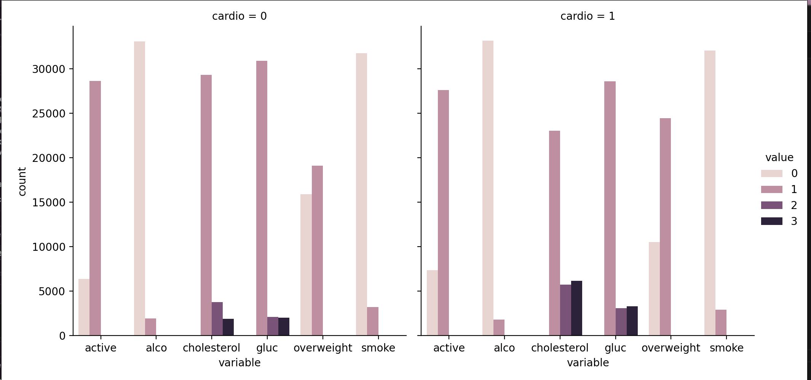
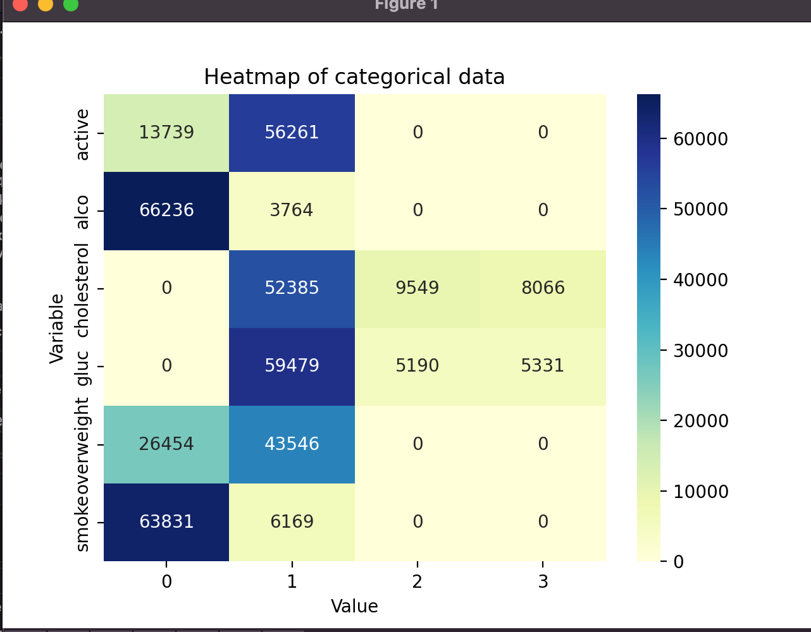
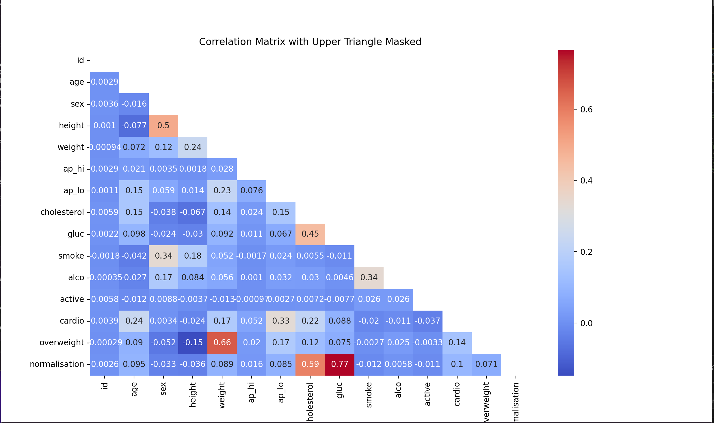
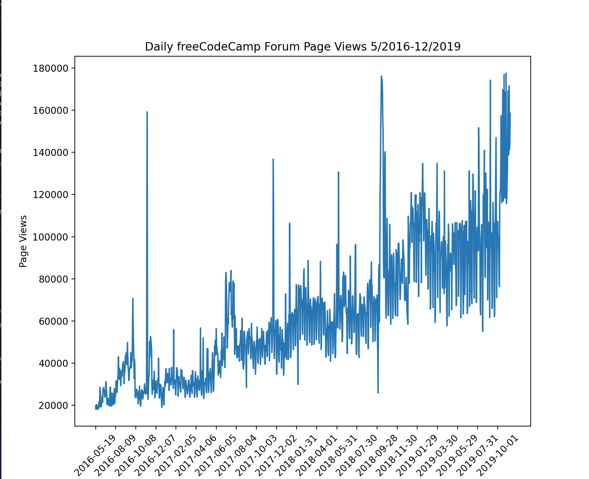
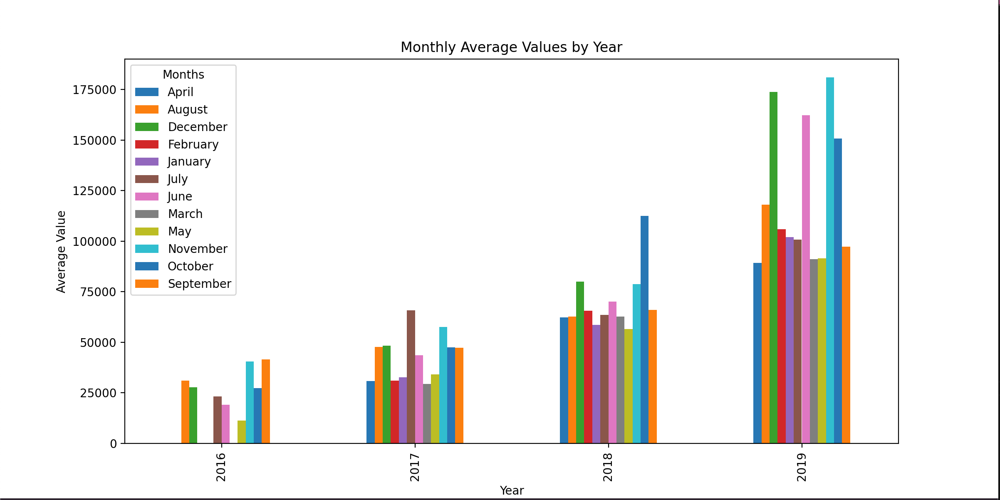
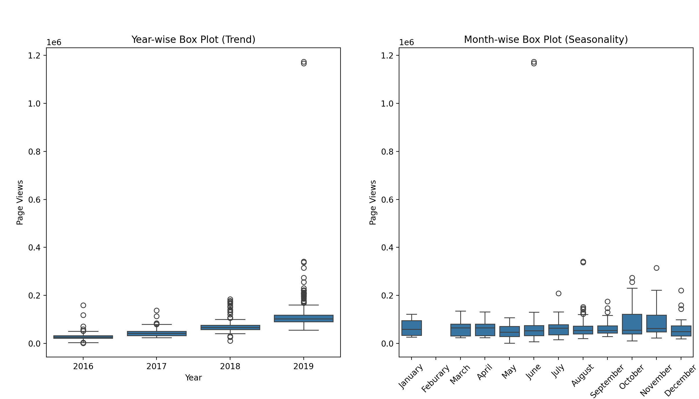
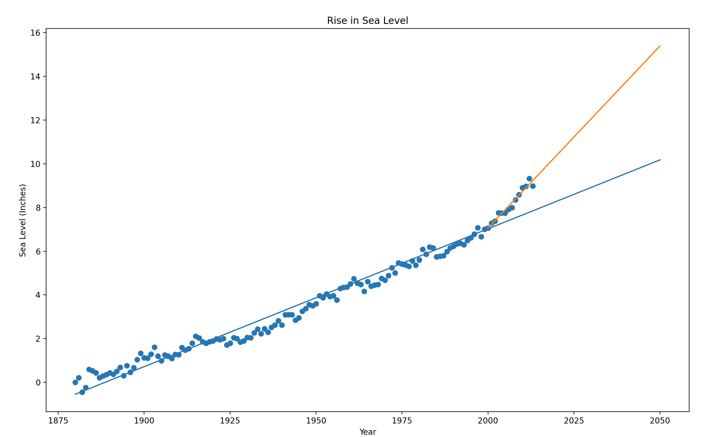

# A collection of Data Analytics Projects

The goal of this project is to showcase skills developed through completing a freeCodeCamp course, the skills learned are shown through a wide range of data analytic projects. The range of projects, with the corresponding datasets, require different data pre-processing, statistical descriptive methods and  visualisation.

Datasets used for this project are publicly available. 

The main python module used througout these projects for the data processing and import from raw data structure(.csv files) was pandas.

## Figures
-
-
-
-
-
-
-

## Description
Description of each of the projects:
1. 3D-Matrix Calculator - This project consists of a function that takes a 1D matrix as an input, and converts this numpy matrix into a 2D 3x3 matrix. The function then returns statistical descriptions of: column-wise internal arrays and row-wise internal arrays and entire flattened array.
The statistical descriptive methods returned:
- Mean
- Variance 
- Standard Deviation
- Max (element)
- Min (element)
- Sum

2. Demographic Data Analyser - The raw data for this project was a CSV file with employment and demographic data of indivis. The pandas module was then used to convert this .csv file to a DataFrame object, so that the data within the data set can be queried to ask questions and reveal answers. Some of the questions included:
- What percent of people without advanced education make more than 50k
- What percent of people who work the minimum number of hourse per week have a salary of more than 50k
- What country has the highest percent of people that earn more than 50k and what is the percentage
- Identify the most popular occupation for those who earn more than 50k in India

3. Medical Data Visualisation - A catplot was created to visualise the count of the different variables such as 'cholesterol' split into two groups of cardio and non-cardio. A heatmap was created also showing the same data. A heatmap displaying the correlation between each of the variables within the DataFrame was also created, a mask had to be applied to the correlation matrix generated by the pandas .corr() method to avoid data being repeated on the heatmap. Before the data was plotting on these graphs, there had to be a process of data preprocessing and cleaning. This process included creating a new column called overweight calculated using the rows 'weight' and 'height'; normalisation of data, which included setting low levels of 'cholestorol' and 'glucouse' to 0 if low and 1 otherwise; removing anomolies - heights and weights lower than the 2.5th percentile and higher than the 97.5th percentile. To ensure that the data was in the correct format to plot categorical data, the data was reshaped from a DataFrame to a Pivot using the pandas.melt method.

4. Web Page View Times - The purpose of this project was to visualise Web Page to see if there were any trends both yearly and seasonaly. The first step of the project was the data cleaning phase, filtering out of the days with the top 2.5% and bottom 2.5% of views. Fig 1 is a line graph showing the changes in the page views (x-axis = the day, y-axis = the number of page views). Fig 2 is a bar chart displaying the monthly views of the page to see any within the months of different years. Fig 3 has 2 sub-plot: 1. A year-wise box plot to show the yearly trend 2. A Month-wise box plot the seasonality trend.

5. Sea Level Prediction - Fig 1 - A scatter plot (x-axis=year, y-axis=Sea Level). Fig 2 - A line of best fit generated using the linear regression method from the scipy.stats module for the scatter plot. The result of this method returned the slope and the y-intercept, the straight line equations was generated and plotted using these values. A new line of best fit was created in the same way to see the trend based on the data points from 2000 onwards to visualise a more updated trend on the projected value of sea level. Both of these line of best fits were plotted up to the year 2050.

## Installation

Use the package manager [pip](https://pip.pypa.io/en/stable/) to install the required packagees. Python version 3.10 was used in the development of the data analytics projects.

```bash
pip install numpy
pip install pandas
pip install matplotlib
pip install seaborn
pip install scipy
```

## Usage
Running the different python modules for each of the projects
1. Project 1:
```bash
python3.10 './3d-matrix-calculator/mean_var_std.py'
```
2. Project 2:
```bash
python3.10 './demographic-data-analyser/main.py'
```
3. Project 3:
```bash
python3.10 './medical_data_visualiation/medical_data_visualisation.py'
```
4. Project 4:
```bash
python3.10 './page-view-time/time_series_visualiser.py'
```
5. Project 5:
```bash
python3.10 './sea-level-predictor/sea_level_predictor.py'
```
